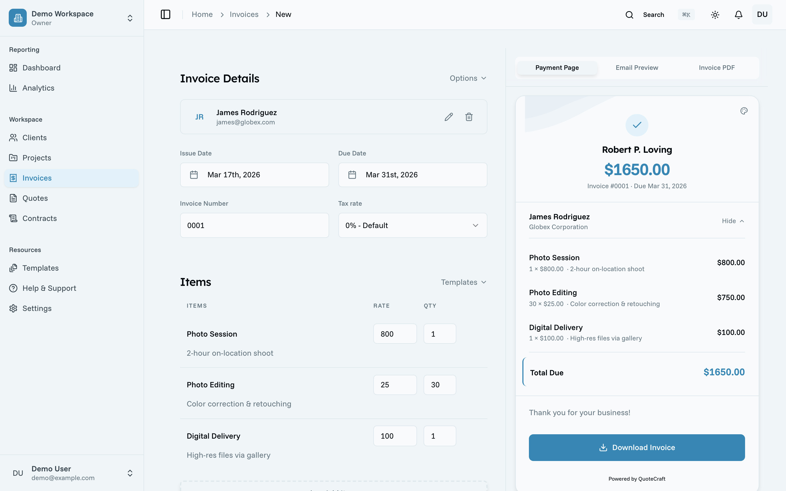
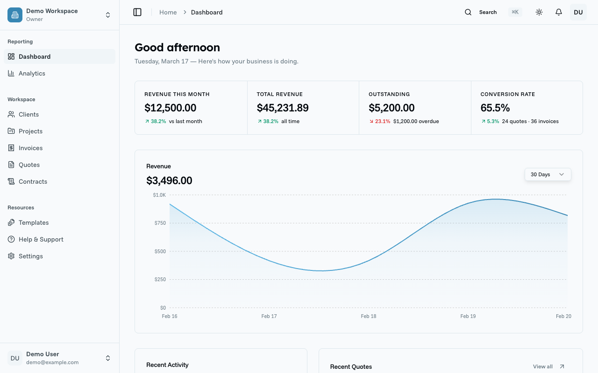
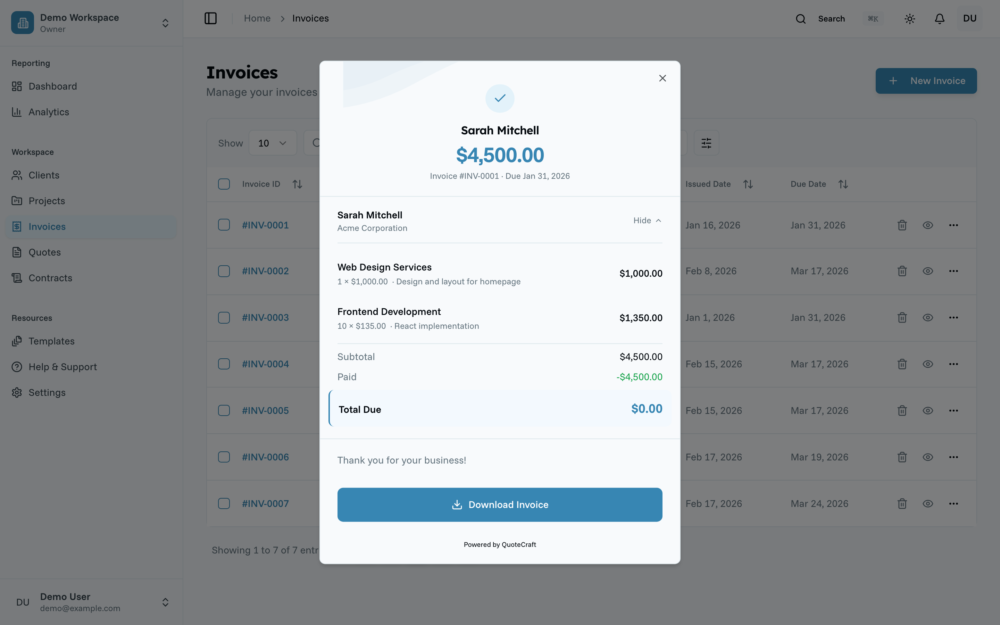
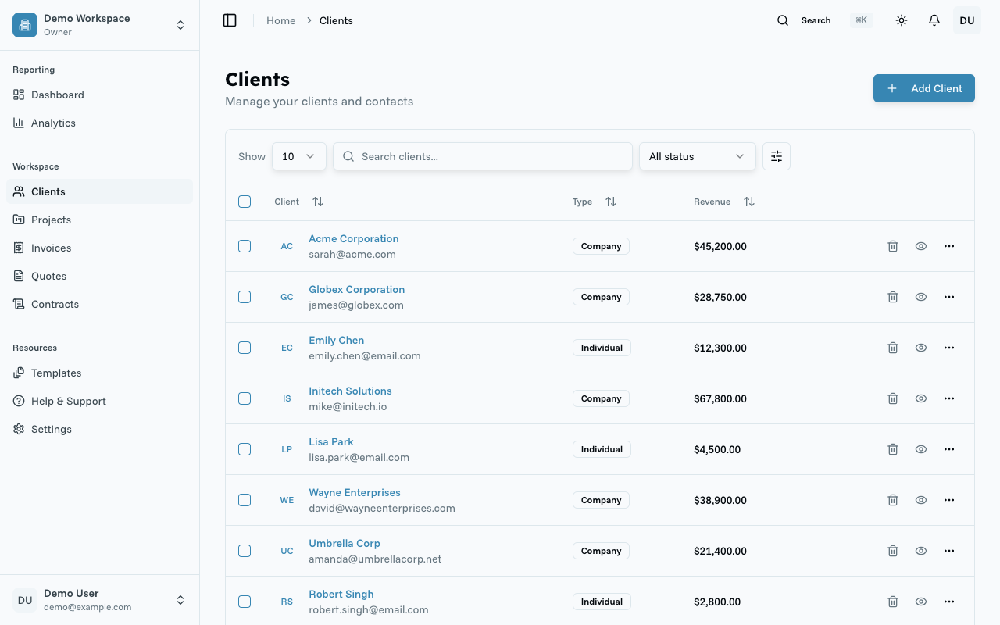

<p align="center">
  <b>Oreko</b>
</p>

<h2 align="center">The invoicing platform you actually own.</h2>

<p align="center">
  Open-source. Self-hosted. Quotes, invoices, contracts, payments, and analytics in one place.<br/>
  Zero subscription fees. Zero lock-in.
</p>

<p align="center">
  <a href="https://oreko.app">Website</a> · <a href="https://oreko.app/docs">Documentation</a> · <a href="https://github.com/orekoapp/oreko/issues">Issues</a>
</p>

<br />

<p align="center">
  <a href="https://oreko.app">
    
  </a>
</p>

<br />

[](https://www.gnu.org/licenses/agpl-3.0)
[](https://github.com/orekoapp/oreko/actions/workflows/ci.yml)
[](https://www.typescriptlang.org/)
[](https://nextjs.org/)

## Why Oreko

**Invoicing tools are expensive, and your data is trapped.** Most platforms use your client data and payment history as leverage to keep you locked in. It shouldn't work that way.

**A fresh approach to quoting and invoicing.** Oreko gives you a visual block-based builder for creating professional quotes that convert to invoices with zero data re-entry — inspired by modern tools like Notion and Linear.

**Open-source and community-driven.** Self-host for free with full control over your data, or use the managed cloud version. AGPL v3 licensed.

<br />

## What You Can Do With Oreko

- [Visual Quote Builder](#visual-quote-builder)
- [Invoicing with one-click conversion](#invoicing-with-one-click-conversion)
- [Client Management](#client-management)
- [Contracts, payments, and analytics](#contracts-payments-and-analytics)

### Visual Quote Builder

Build branded quotes in your visual editor. Add line items, apply discounts, set payment terms, and send to clients for review.

<p align="center">
  
</p>

### Invoicing with one-click conversion

Create invoices from scratch or convert accepted quotes with one click. Track payment status in real time.

<p align="center">
  
</p>

### Client Management

Centralized client database with full history, lifetime value tracking, and contact management.

<p align="center">
  
</p>

### Contracts, payments, and analytics

| Feature                        | Description                                                                 |
| ------------------------------ | --------------------------------------------------------------------------- |
| **E-Signature Capture**        | Legally compliant electronic signatures (E-SIGN, UETA)                      |
| **Stripe Payment Integration** | Accept credit cards and ACH payments via Stripe Connect                     |
| **PDF Generation**             | Professional PDF exports for quotes and invoices                            |
| **Email Notifications**        | Automated email workflows for quotes, invoices, and reminders               |
| **Dashboard Analytics**        | Revenue trends, quote conversion rates, invoice status, and client insights |
| **Contract Templates**         | Draft contracts from templates, send for e-signature                        |
| **Rate Card System**           | Predefined services and pricing tiers for quick quoting                     |
| **Milestone Payments**         | Support for deposits, milestones, and recurring payments                    |
| **Modular Workspace**          | Enable only the modules you need                                            |
| **Self-Hosted**                | Full control over your data with Docker deployment                          |

<br />

## Quick Start

### Using Docker for Services

The base `docker-compose.yml` runs supporting services (PostgreSQL, Mailpit) while you run Next.js locally:

```bash
git clone https://github.com/orekoapp/oreko.git
cd oreko
cp .env.example .env.local   # Next.js loads .env.local automatically
docker-compose up -d          # Start Postgres and Mailpit
pnpm install
pnpm db:migrate
pnpm dev
```

Open `http://localhost:3000`

### Manual Installation (No Docker)

```bash
git clone https://github.com/orekoapp/oreko.git
cd oreko
pnpm install
cp .env.example .env.local   # Next.js loads .env.local automatically
# Ensure PostgreSQL is running and DATABASE_URL is set in .env.local
pnpm db:migrate
pnpm dev
```

See the [full setup guide](https://oreko.app/docs) for detailed instructions.

<br />

## Stack

- [TypeScript](https://www.typescriptlang.org/) 5.x
- [Next.js](https://nextjs.org/) 14+ (App Router)
- [Prisma](https://www.prisma.io/) + [PostgreSQL](https://www.postgresql.org/)
- [Shadcn UI](https://ui.shadcn.com/) + [Tailwind CSS](https://tailwindcss.com/)
- [Stripe Connect](https://stripe.com/connect) for payments
- [Turborepo](https://turbo.build/) monorepo
- [Docker](https://www.docker.com/) for deployment

<br />

## Contributing

We welcome contributions! See our [Contributing Guide](CONTRIBUTING.md) for details.

Check `specs/PRODUCT_SPEC.md` for the roadmap and `specs/TECHNICAL_SPEC.md` for architecture details.

```bash
# Fork, clone, then:
pnpm install
pnpm dev          # Start dev server
pnpm test         # Run tests
pnpm lint         # Lint codebase
```

<br />

## License

Oreko is open-source software licensed under the [GNU Affero General Public License v3.0](LICENSE).

<br />

## Support

- **Website:** [oreko.app](https://oreko.app)
- **Documentation:** [oreko.app/docs](https://oreko.app/docs)
- **Issues:** [GitHub Issues](https://github.com/orekoapp/oreko/issues)
- **Email:** support@oreko.app

---

Built with care by the Oreko community.
