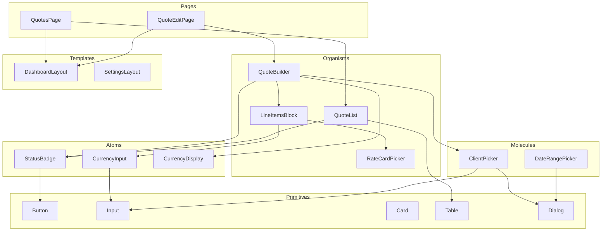

# Oreko Component Design

## 1. Component Architecture Overview

### 1.1 Component Categories

```
┌─────────────────────────────────────────────────────────────────┐
│                    COMPONENT HIERARCHY                          │
├─────────────────────────────────────────────────────────────────┤
│                                                                 │
│  PRIMITIVES (packages/ui)                                       │
│  └── Shadcn UI components (Button, Input, Card, etc.)          │
│                                                                 │
│  ATOMS (apps/web/components/ui)                                 │
│  └── Extended primitives (StatusBadge, CurrencyInput, etc.)    │
│                                                                 │
│  MOLECULES (apps/web/components/shared)                         │
│  └── Composed components (ClientPicker, DateRangePicker, etc.) │
│                                                                 │
│  ORGANISMS (apps/web/components/[feature])                      │
│  └── Feature components (QuoteBuilder, InvoiceList, etc.)      │
│                                                                 │
│  TEMPLATES (apps/web/components/layouts)                        │
│  └── Page layouts (DashboardLayout, SettingsLayout, etc.)      │
│                                                                 │
│  PAGES (apps/web/app)                                           │
│  └── Next.js pages using templates and organisms               │
│                                                                 │
└─────────────────────────────────────────────────────────────────┘
```

### 1.2 Server vs Client Components

```typescript
// Server Components (default)
// - Data fetching
// - Static rendering
// - No interactivity

// app/(dashboard)/quotes/page.tsx
export default async function QuotesPage() {
  const quotes = await getQuotes(); // Server-side fetch
  return <QuotesList quotes={quotes} />;
}

// Client Components (when needed)
// - Event handlers
// - useState, useEffect
// - Browser APIs

// components/quotes/QuoteBuilder.tsx
'use client';
export function QuoteBuilder({ quote }: Props) {
  const [blocks, setBlocks] = useState(quote.blocks);
  // Interactive quote editing
}
```

---

## 2. Core UI Components

### 2.1 Layout Components

```typescript
// components/layouts/DashboardLayout.tsx
interface DashboardLayoutProps {
  children: React.ReactNode;
}

export function DashboardLayout({ children }: DashboardLayoutProps) {
  return (
    <div className="flex h-screen">
      <Sidebar />
      <div className="flex-1 flex flex-col">
        <Header />
        <main className="flex-1 overflow-auto bg-neutral-50 p-6">
          {children}
        </main>
      </div>
    </div>
  );
}

// components/layouts/Sidebar.tsx
interface SidebarProps {
  collapsed?: boolean;
}

export function Sidebar({ collapsed = false }: SidebarProps) {
  return (
    <aside className={cn(
      'bg-white border-r border-neutral-200 flex flex-col',
      collapsed ? 'w-16' : 'w-60'
    )}>
      <Logo />
      <Navigation />
      <WorkspaceSwitcher />
      <UserMenu />
    </aside>
  );
}

// components/layouts/PageHeader.tsx
interface PageHeaderProps {
  title: string;
  description?: string;
  actions?: React.ReactNode;
  breadcrumb?: { label: string; href?: string }[];
}

export function PageHeader({ title, description, actions, breadcrumb }: PageHeaderProps) {
  return (
    <div className="flex items-center justify-between mb-6">
      <div>
        {breadcrumb && <Breadcrumb items={breadcrumb} />}
        <h1 className="text-2xl font-semibold text-neutral-900">{title}</h1>
        {description && <p className="text-neutral-500 mt-1">{description}</p>}
      </div>
      {actions && <div className="flex gap-2">{actions}</div>}
    </div>
  );
}
```

### 2.2 Data Display Components

```typescript
// components/ui/StatusBadge.tsx
type StatusVariant =
  | 'draft'
  | 'sent'
  | 'viewed'
  | 'accepted'
  | 'declined'
  | 'expired'
  | 'paid'
  | 'overdue'
  | 'partial';

interface StatusBadgeProps {
  status: StatusVariant;
  className?: string;
}

const statusConfig: Record<StatusVariant, { label: string; className: string; icon: LucideIcon }> = {
  draft: { label: 'Draft', className: 'bg-neutral-100 text-neutral-600', icon: Circle },
  sent: { label: 'Sent', className: 'bg-blue-100 text-blue-700', icon: Send },
  viewed: { label: 'Viewed', className: 'bg-purple-100 text-purple-700', icon: Eye },
  accepted: { label: 'Accepted', className: 'bg-green-100 text-green-700', icon: Check },
  declined: { label: 'Declined', className: 'bg-red-100 text-red-700', icon: X },
  expired: { label: 'Expired', className: 'bg-orange-100 text-orange-700', icon: Clock },
  paid: { label: 'Paid', className: 'bg-green-500 text-white', icon: CheckCircle },
  overdue: { label: 'Overdue', className: 'bg-red-100 text-red-700', icon: AlertCircle },
  partial: { label: 'Partial', className: 'bg-yellow-100 text-yellow-700', icon: Percent },
};

export function StatusBadge({ status, className }: StatusBadgeProps) {
  const config = statusConfig[status];
  const Icon = config.icon;

  return (
    <span className={cn(
      'inline-flex items-center gap-1 px-2 py-1 rounded-full text-xs font-medium',
      config.className,
      className
    )}>
      <Icon className="h-3 w-3" />
      {config.label}
    </span>
  );
}

// components/ui/CurrencyDisplay.tsx
interface CurrencyDisplayProps {
  amount: number;
  currency?: string;
  className?: string;
}

export function CurrencyDisplay({ amount, currency = 'USD', className }: CurrencyDisplayProps) {
  const formatted = new Intl.NumberFormat('en-US', {
    style: 'currency',
    currency,
  }).format(amount);

  return <span className={className}>{formatted}</span>;
}

// components/ui/DataTable.tsx
interface DataTableProps<T> {
  columns: ColumnDef<T>[];
  data: T[];
  loading?: boolean;
  emptyState?: React.ReactNode;
  onRowClick?: (row: T) => void;
  selectedRows?: T[];
  onSelectionChange?: (rows: T[]) => void;
}

export function DataTable<T>({
  columns,
  data,
  loading,
  emptyState,
  onRowClick,
  selectedRows,
  onSelectionChange,
}: DataTableProps<T>) {
  // Using TanStack Table for advanced features
  // Sorting, filtering, pagination, selection
}
```

### 2.3 Form Components

```typescript
// components/ui/CurrencyInput.tsx
interface CurrencyInputProps extends Omit<InputProps, 'type' | 'value' | 'onChange'> {
  value: number;
  onChange: (value: number) => void;
  currency?: string;
}

export function CurrencyInput({ value, onChange, currency = 'USD', ...props }: CurrencyInputProps) {
  const [displayValue, setDisplayValue] = useState(formatCurrency(value));

  const handleBlur = () => {
    const numericValue = parseCurrency(displayValue);
    onChange(numericValue);
    setDisplayValue(formatCurrency(numericValue));
  };

  return (
    <div className="relative">
      <span className="absolute left-3 top-1/2 -translate-y-1/2 text-neutral-500">$</span>
      <Input
        {...props}
        className={cn('pl-7', props.className)}
        value={displayValue}
        onChange={(e) => setDisplayValue(e.target.value)}
        onBlur={handleBlur}
      />
    </div>
  );
}

// components/shared/ClientPicker.tsx
interface ClientPickerProps {
  value?: string; // Client ID
  onChange: (clientId: string) => void;
  onCreateNew?: () => void;
}

export function ClientPicker({ value, onChange, onCreateNew }: ClientPickerProps) {
  const [search, setSearch] = useState('');
  const [open, setOpen] = useState(false);
  const clients = useClients(search); // Custom hook with debounced search

  return (
    <Popover open={open} onOpenChange={setOpen}>
      <PopoverTrigger asChild>
        <Button variant="outline" className="w-full justify-between">
          {value ? clients.find(c => c.id === value)?.name : 'Select client...'}
          <ChevronsUpDown className="h-4 w-4 opacity-50" />
        </Button>
      </PopoverTrigger>
      <PopoverContent className="w-[400px] p-0">
        <Command>
          <CommandInput
            placeholder="Search clients..."
            value={search}
            onValueChange={setSearch}
          />
          <CommandList>
            <CommandEmpty>
              <p className="text-sm text-neutral-500">No clients found</p>
              {onCreateNew && (
                <Button variant="ghost" onClick={onCreateNew} className="mt-2">
                  <Plus className="h-4 w-4 mr-2" />
                  Create new client
                </Button>
              )}
            </CommandEmpty>
            <CommandGroup>
              {clients.map((client) => (
                <CommandItem
                  key={client.id}
                  value={client.id}
                  onSelect={() => {
                    onChange(client.id);
                    setOpen(false);
                  }}
                >
                  <Avatar className="h-8 w-8 mr-2">
                    <AvatarFallback>{getInitials(client.name)}</AvatarFallback>
                  </Avatar>
                  <div>
                    <p className="font-medium">{client.name}</p>
                    {client.company && (
                      <p className="text-xs text-neutral-500">{client.company}</p>
                    )}
                  </div>
                  {value === client.id && <Check className="h-4 w-4 ml-auto" />}
                </CommandItem>
              ))}
            </CommandGroup>
          </CommandList>
        </Command>
      </PopoverContent>
    </Popover>
  );
}

// components/shared/DateRangePicker.tsx
interface DateRangePickerProps {
  value: { from: Date; to: Date } | undefined;
  onChange: (range: { from: Date; to: Date } | undefined) => void;
  presets?: { label: string; value: { from: Date; to: Date } }[];
}

export function DateRangePicker({ value, onChange, presets }: DateRangePickerProps) {
  return (
    <Popover>
      <PopoverTrigger asChild>
        <Button variant="outline" className="justify-start">
          <CalendarIcon className="h-4 w-4 mr-2" />
          {value ? `${format(value.from, 'MMM d')} - ${format(value.to, 'MMM d')}` : 'Select dates'}
        </Button>
      </PopoverTrigger>
      <PopoverContent className="w-auto p-0" align="start">
        {presets && (
          <div className="p-2 border-b">
            {presets.map((preset) => (
              <Button
                key={preset.label}
                variant="ghost"
                size="sm"
                onClick={() => onChange(preset.value)}
              >
                {preset.label}
              </Button>
            ))}
          </div>
        )}
        <Calendar
          mode="range"
          selected={value}
          onSelect={onChange}
          numberOfMonths={2}
        />
      </PopoverContent>
    </Popover>
  );
}
```

---

## 3. Quote Builder Components

### 3.1 Editor Layout

```typescript
// components/quotes/QuoteBuilder.tsx
'use client';

interface QuoteBuilderProps {
  quote: Quote;
  onSave: (quote: Quote) => Promise<void>;
}

export function QuoteBuilder({ quote: initialQuote, onSave }: QuoteBuilderProps) {
  const [quote, setQuote] = useState(initialQuote);
  const [selectedBlockId, setSelectedBlockId] = useState<string | null>(null);
  const [isSaving, setIsSaving] = useState(false);

  // Auto-save with debounce
  useAutosave(quote, onSave);

  return (
    <DndContext onDragEnd={handleDragEnd}>
      <div className="flex h-full">
        {/* Blocks Panel */}
        <BlocksPanel onAddBlock={handleAddBlock} />

        {/* Document Canvas */}
        <DocumentCanvas
          quote={quote}
          selectedBlockId={selectedBlockId}
          onSelectBlock={setSelectedBlockId}
          onUpdateBlock={handleUpdateBlock}
          onDeleteBlock={handleDeleteBlock}
          onReorderBlocks={handleReorderBlocks}
        />

        {/* Properties Panel */}
        <PropertiesPanel
          quote={quote}
          selectedBlock={selectedBlockId ? getBlock(selectedBlockId) : null}
          onUpdateQuote={setQuote}
          onUpdateBlock={handleUpdateBlock}
        />
      </div>
    </DndContext>
  );
}

// components/quotes/BlocksPanel.tsx
interface BlocksPanelProps {
  onAddBlock: (type: BlockType) => void;
}

const blockTypes: { type: BlockType; label: string; icon: LucideIcon }[] = [
  { type: 'header', label: 'Header', icon: Type },
  { type: 'text', label: 'Text', icon: AlignLeft },
  { type: 'line_items', label: 'Line Items', icon: List },
  { type: 'image', label: 'Image', icon: Image },
  { type: 'divider', label: 'Divider', icon: Minus },
  { type: 'signature', label: 'Signature', icon: PenTool },
];

export function BlocksPanel({ onAddBlock }: BlocksPanelProps) {
  const rateCards = useRateCards();

  return (
    <aside className="w-48 border-r bg-white p-4 flex flex-col">
      <h3 className="text-xs font-semibold text-neutral-500 uppercase mb-3">Blocks</h3>
      <div className="space-y-2">
        {blockTypes.map(({ type, label, icon: Icon }) => (
          <DraggableBlock key={type} type={type}>
            <button
              onClick={() => onAddBlock(type)}
              className="flex items-center gap-2 w-full p-2 rounded-md hover:bg-neutral-100"
            >
              <Icon className="h-4 w-4 text-neutral-500" />
              <span className="text-sm">{label}</span>
            </button>
          </DraggableBlock>
        ))}
      </div>

      <Separator className="my-4" />

      <h3 className="text-xs font-semibold text-neutral-500 uppercase mb-3">Rate Cards</h3>
      <div className="space-y-1 overflow-auto flex-1">
        {rateCards.map((card) => (
          <DraggableRateCard key={card.id} rateCard={card}>
            <div className="p-2 rounded-md hover:bg-neutral-100 cursor-grab">
              <p className="text-sm font-medium truncate">{card.name}</p>
              <p className="text-xs text-neutral-500">{formatCurrency(card.rate)}</p>
            </div>
          </DraggableRateCard>
        ))}
      </div>
    </aside>
  );
}

// components/quotes/DocumentCanvas.tsx
interface DocumentCanvasProps {
  quote: Quote;
  selectedBlockId: string | null;
  onSelectBlock: (id: string | null) => void;
  onUpdateBlock: (id: string, data: Partial<Block>) => void;
  onDeleteBlock: (id: string) => void;
  onReorderBlocks: (startIndex: number, endIndex: number) => void;
}

export function DocumentCanvas({
  quote,
  selectedBlockId,
  onSelectBlock,
  onUpdateBlock,
  onDeleteBlock,
  onReorderBlocks,
}: DocumentCanvasProps) {
  return (
    <div className="flex-1 bg-neutral-100 p-8 overflow-auto">
      <div className="bg-white mx-auto max-w-[680px] shadow-lg rounded-lg">
        <SortableContext items={quote.blocks.map(b => b.id)}>
          {quote.blocks.map((block, index) => (
            <SortableBlock
              key={block.id}
              id={block.id}
              isSelected={selectedBlockId === block.id}
              onClick={() => onSelectBlock(block.id)}
            >
              <BlockRenderer
                block={block}
                onChange={(data) => onUpdateBlock(block.id, data)}
                onDelete={() => onDeleteBlock(block.id)}
              />
            </SortableBlock>
          ))}
        </SortableContext>

        <AddBlockButton onClick={() => {/* Show block picker */}} />

        {/* Totals Section (always visible) */}
        <QuoteTotals quote={quote} />
      </div>
    </div>
  );
}

// components/quotes/PropertiesPanel.tsx
interface PropertiesPanelProps {
  quote: Quote;
  selectedBlock: Block | null;
  onUpdateQuote: (quote: Quote) => void;
  onUpdateBlock: (id: string, data: Partial<Block>) => void;
}

export function PropertiesPanel({
  quote,
  selectedBlock,
  onUpdateQuote,
  onUpdateBlock,
}: PropertiesPanelProps) {
  return (
    <aside className="w-72 border-l bg-white p-4 overflow-auto">
      {selectedBlock ? (
        <BlockProperties block={selectedBlock} onChange={onUpdateBlock} />
      ) : (
        <QuoteProperties quote={quote} onChange={onUpdateQuote} />
      )}
    </aside>
  );
}
```

### 3.2 Block Components

```typescript
// components/quotes/blocks/LineItemsBlock.tsx
'use client';

interface LineItemsBlockProps {
  items: LineItem[];
  onChange: (items: LineItem[]) => void;
  rateCards: RateCard[];
}

export function LineItemsBlock({ items, onChange, rateCards }: LineItemsBlockProps) {
  const addItem = () => {
    onChange([
      ...items,
      {
        id: generateId(),
        name: '',
        description: '',
        quantity: 1,
        rate: 0,
        amount: 0,
        sortOrder: items.length,
      },
    ]);
  };

  const updateItem = (index: number, data: Partial<LineItem>) => {
    const newItems = [...items];
    newItems[index] = {
      ...newItems[index],
      ...data,
      amount: (data.quantity ?? newItems[index].quantity) * (data.rate ?? newItems[index].rate),
    };
    onChange(newItems);
  };

  const deleteItem = (index: number) => {
    onChange(items.filter((_, i) => i !== index));
  };

  return (
    <div className="p-6">
      <SortableContext items={items.map(i => i.id)}>
        <div className="space-y-4">
          {items.map((item, index) => (
            <SortableItem key={item.id} id={item.id}>
              <LineItemRow
                item={item}
                onChange={(data) => updateItem(index, data)}
                onDelete={() => deleteItem(index)}
                rateCards={rateCards}
              />
            </SortableItem>
          ))}
        </div>
      </SortableContext>

      <Button variant="ghost" className="mt-4" onClick={addItem}>
        <Plus className="h-4 w-4 mr-2" />
        Add line item
      </Button>
    </div>
  );
}

// components/quotes/blocks/LineItemRow.tsx
interface LineItemRowProps {
  item: LineItem;
  onChange: (data: Partial<LineItem>) => void;
  onDelete: () => void;
  rateCards: RateCard[];
}

export function LineItemRow({ item, onChange, onDelete, rateCards }: LineItemRowProps) {
  const [showRateCardPicker, setShowRateCardPicker] = useState(false);

  return (
    <div className="group relative border rounded-lg p-4 hover:border-primary-200">
      {/* Drag handle */}
      <div className="absolute -left-6 top-1/2 -translate-y-1/2 opacity-0 group-hover:opacity-100">
        <GripVertical className="h-5 w-5 text-neutral-400 cursor-grab" />
      </div>

      {/* Item content */}
      <div className="space-y-3">
        <div className="flex gap-4">
          <div className="flex-1">
            <Input
              value={item.name}
              onChange={(e) => onChange({ name: e.target.value })}
              placeholder="Item name"
              className="font-medium"
            />
          </div>
          <Button
            variant="ghost"
            size="icon"
            onClick={() => setShowRateCardPicker(true)}
            title="Add from rate card"
          >
            <Bookmark className="h-4 w-4" />
          </Button>
          <Button
            variant="ghost"
            size="icon"
            onClick={onDelete}
            className="text-neutral-400 hover:text-red-500"
          >
            <Trash2 className="h-4 w-4" />
          </Button>
        </div>

        <Textarea
          value={item.description || ''}
          onChange={(e) => onChange({ description: e.target.value })}
          placeholder="Description (optional)"
          className="min-h-[60px]"
        />

        <div className="flex gap-4 items-center">
          <div className="w-24">
            <Label className="text-xs text-neutral-500">Qty</Label>
            <Input
              type="number"
              value={item.quantity}
              onChange={(e) => onChange({ quantity: parseFloat(e.target.value) || 0 })}
              min={0}
              step={0.5}
            />
          </div>
          <div className="w-32">
            <Label className="text-xs text-neutral-500">Rate</Label>
            <CurrencyInput
              value={item.rate}
              onChange={(rate) => onChange({ rate })}
            />
          </div>
          <div className="flex-1 text-right">
            <Label className="text-xs text-neutral-500">Amount</Label>
            <p className="text-lg font-semibold">
              <CurrencyDisplay amount={item.amount} />
            </p>
          </div>
        </div>
      </div>

      {/* Rate card picker modal */}
      <RateCardPickerModal
        open={showRateCardPicker}
        onClose={() => setShowRateCardPicker(false)}
        onSelect={(rateCard) => {
          onChange({
            name: rateCard.name,
            description: rateCard.description,
            rate: rateCard.rate,
            rateCardId: rateCard.id,
          });
          setShowRateCardPicker(false);
        }}
        rateCards={rateCards}
      />
    </div>
  );
}

// components/quotes/blocks/SignatureBlock.tsx
'use client';

interface SignatureBlockProps {
  signature?: SignatureData;
  onChange: (signature: SignatureData) => void;
  mode: 'edit' | 'sign';
}

export function SignatureBlock({ signature, onChange, mode }: SignatureBlockProps) {
  const [signatureMode, setSignatureMode] = useState<'draw' | 'type'>('draw');

  if (mode === 'edit') {
    return (
      <div className="p-6 border-t">
        <div className="flex items-center gap-2 text-neutral-500">
          <PenTool className="h-5 w-5" />
          <span>Client signature will appear here</span>
        </div>
      </div>
    );
  }

  return (
    <div className="p-6 border-t">
      <h3 className="font-medium mb-4">Your Signature</h3>

      <Tabs value={signatureMode} onValueChange={(v) => setSignatureMode(v as 'draw' | 'type')}>
        <TabsList>
          <TabsTrigger value="draw">Draw</TabsTrigger>
          <TabsTrigger value="type">Type</TabsTrigger>
        </TabsList>

        <TabsContent value="draw">
          <SignatureCanvas
            onSave={(dataUrl) => onChange({ type: 'drawn', data: dataUrl })}
          />
        </TabsContent>

        <TabsContent value="type">
          <SignatureTyper
            onSave={(name) => onChange({ type: 'typed', data: name })}
          />
        </TabsContent>
      </Tabs>

      <p className="text-xs text-neutral-500 mt-4">
        By signing, you agree to the terms and conditions of this quote.
      </p>
    </div>
  );
}
```

---

## 4. Client Portal Components

### 4.1 Quote Accept Page

```typescript
// components/portal/QuotePortal.tsx
interface QuotePortalProps {
  quote: PublicQuote;
  workspace: PublicWorkspace;
}

export function QuotePortal({ quote, workspace }: QuotePortalProps) {
  const [step, setStep] = useState<'view' | 'contract' | 'sign' | 'pay' | 'complete'>('view');
  const [signature, setSignature] = useState<SignatureData | null>(null);

  const hasContract = quote.contract !== null;
  const hasDeposit = quote.depositEnabled && quote.depositAmount > 0;

  return (
    <div className="min-h-screen bg-neutral-50">
      {/* Branded Header */}
      <header className="bg-white border-b py-4">
        <div className="max-w-3xl mx-auto px-4">
          {workspace.logoUrl ? (
            
          ) : (
            <span className="text-xl font-semibold">{workspace.name}</span>
          )}
        </div>
      </header>

      {/* Main Content */}
      <main className="max-w-3xl mx-auto px-4 py-8">
        <Card>
          {step === 'view' && (
            <QuoteView
              quote={quote}
              onContinue={() => setStep(hasContract ? 'contract' : 'sign')}
            />
          )}

          {step === 'contract' && quote.contract && (
            <ContractView
              contract={quote.contract}
              onAccept={() => setStep('sign')}
              onBack={() => setStep('view')}
            />
          )}

          {step === 'sign' && (
            <SignatureCapture
              onSign={(sig) => {
                setSignature(sig);
                setStep(hasDeposit ? 'pay' : 'complete');
              }}
              onBack={() => setStep(hasContract ? 'contract' : 'view')}
            />
          )}

          {step === 'pay' && signature && (
            <DepositPayment
              quote={quote}
              signature={signature}
              onSuccess={() => setStep('complete')}
              onBack={() => setStep('sign')}
            />
          )}

          {step === 'complete' && (
            <AcceptanceComplete quote={quote} workspace={workspace} />
          )}
        </Card>
      </main>

      {/* Footer */}
      <footer className="py-4 text-center text-sm text-neutral-500">
        Questions? Contact {workspace.email}
      </footer>
    </div>
  );
}

// components/portal/SignatureCapture.tsx
'use client';

interface SignatureCaptureProps {
  onSign: (signature: SignatureData) => void;
  onBack: () => void;
}

export function SignatureCapture({ onSign, onBack }: SignatureCaptureProps) {
  const [mode, setMode] = useState<'draw' | 'type'>('draw');
  const [agreed, setAgreed] = useState(false);
  const canvasRef = useRef<HTMLCanvasElement>(null);
  const [typedName, setTypedName] = useState('');

  const handleSubmit = () => {
    if (!agreed) return;

    if (mode === 'draw' && canvasRef.current) {
      const dataUrl = canvasRef.current.toDataURL();
      onSign({ type: 'drawn', data: dataUrl });
    } else if (mode === 'type' && typedName) {
      onSign({ type: 'typed', data: typedName });
    }
  };

  return (
    <div className="p-6">
      <h2 className="text-xl font-semibold mb-6">Sign to Accept</h2>

      <div className="space-y-6">
        {/* Agreement checkbox */}
        <div className="flex items-start gap-3">
          <Checkbox
            id="agree"
            checked={agreed}
            onCheckedChange={(checked) => setAgreed(checked === true)}
          />
          <Label htmlFor="agree" className="text-sm">
            I have read and agree to the terms and conditions of this quote.
          </Label>
        </div>

        {/* Signature mode tabs */}
        <Tabs value={mode} onValueChange={(v) => setMode(v as 'draw' | 'type')}>
          <TabsList className="grid w-full grid-cols-2">
            <TabsTrigger value="draw">
              <PenTool className="h-4 w-4 mr-2" />
              Draw Signature
            </TabsTrigger>
            <TabsTrigger value="type">
              <Type className="h-4 w-4 mr-2" />
              Type Signature
            </TabsTrigger>
          </TabsList>

          <TabsContent value="draw" className="mt-4">
            <div className="border rounded-lg">
              <canvas
                ref={canvasRef}
                className="w-full h-40 touch-none"
                // Canvas drawing logic handled by hook
              />
            </div>
            <Button variant="ghost" size="sm" onClick={clearCanvas}>
              Clear
            </Button>
          </TabsContent>

          <TabsContent value="type" className="mt-4">
            <Input
              placeholder="Type your full name"
              value={typedName}
              onChange={(e) => setTypedName(e.target.value)}
              className="text-lg"
            />
            {typedName && (
              <div className="mt-4 p-4 border rounded-lg bg-neutral-50">
                <span className="font-signature text-2xl">{typedName}</span>
              </div>
            )}
          </TabsContent>
        </Tabs>

        {/* Actions */}
        <div className="flex gap-4">
          <Button variant="outline" onClick={onBack}>
            Back
          </Button>
          <Button
            className="flex-1"
            onClick={handleSubmit}
            disabled={!agreed || (mode === 'type' && !typedName)}
          >
            Sign & Continue
          </Button>
        </div>
      </div>
    </div>
  );
}

// components/portal/DepositPayment.tsx
'use client';

interface DepositPaymentProps {
  quote: PublicQuote;
  signature: SignatureData;
  onSuccess: () => void;
  onBack: () => void;
}

export function DepositPayment({ quote, signature, onSuccess, onBack }: DepositPaymentProps) {
  const [paymentMethod, setPaymentMethod] = useState<'card' | 'bank'>('card');
  const [isProcessing, setIsProcessing] = useState(false);

  const stripe = useStripe();
  const elements = useElements();

  const handleSubmit = async () => {
    if (!stripe || !elements) return;

    setIsProcessing(true);

    try {
      // Create payment intent on server
      const { clientSecret } = await createPaymentIntent({
        quoteId: quote.id,
        signature,
        paymentMethod,
      });

      // Confirm payment
      const result = await stripe.confirmPayment({
        clientSecret,
        elements,
        confirmParams: {
          return_url: `${window.location.origin}/quotes/${quote.accessToken}/complete`,
        },
      });

      if (result.error) {
        throw new Error(result.error.message);
      }

      onSuccess();
    } catch (error) {
      // Show error toast
    } finally {
      setIsProcessing(false);
    }
  };

  return (
    <div className="p-6">
      <h2 className="text-xl font-semibold mb-2">Pay Deposit</h2>
      <p className="text-neutral-500 mb-6">
        A deposit of <CurrencyDisplay amount={quote.depositAmount} /> is required to accept this quote.
      </p>

      {/* Payment method selection */}
      <RadioGroup value={paymentMethod} onValueChange={setPaymentMethod}>
        <div className="space-y-3">
          <PaymentMethodOption
            value="card"
            label="Credit Card"
            description="Visa, Mastercard, Amex"
            fee={quote.cardFee}
          />
          {quote.achEnabled && (
            <PaymentMethodOption
              value="bank"
              label="Bank Transfer (ACH)"
              description="No processing fee"
              fee={0}
            />
          )}
        </div>
      </RadioGroup>

      {/* Stripe Elements */}
      <div className="mt-6">
        {paymentMethod === 'card' ? (
          <PaymentElement />
        ) : (
          <BankAccountForm />
        )}
      </div>

      {/* Actions */}
      <div className="flex gap-4 mt-6">
        <Button variant="outline" onClick={onBack} disabled={isProcessing}>
          Back
        </Button>
        <Button
          className="flex-1"
          onClick={handleSubmit}
          disabled={isProcessing}
        >
          {isProcessing ? (
            <>
              <Loader2 className="h-4 w-4 mr-2 animate-spin" />
              Processing...
            </>
          ) : (
            <>Pay <CurrencyDisplay amount={quote.depositAmount} /></>
          )}
        </Button>
      </div>

      {/* Security badge */}
      <div className="flex items-center justify-center gap-2 mt-6 text-neutral-500 text-sm">
        <Lock className="h-4 w-4" />
        Secured by Stripe
      </div>
    </div>
  );
}
```

---

## 5. Dashboard Components

```typescript
// components/dashboard/StatsGrid.tsx
interface StatsGridProps {
  stats: DashboardStats;
}

export function StatsGrid({ stats }: StatsGridProps) {
  return (
    <div className="grid grid-cols-1 md:grid-cols-3 gap-4">
      <StatCard
        title="Outstanding Invoices"
        value={stats.outstandingAmount}
        format="currency"
        description={`${stats.outstandingCount} invoices`}
        icon={DollarSign}
        trend={stats.outstandingTrend}
        variant="warning"
      />
      <StatCard
        title="Pending Quotes"
        value={stats.pendingQuotesCount}
        format="number"
        description={`${formatCurrency(stats.pendingQuotesValue)} total`}
        icon={FileText}
        variant="primary"
      />
      <StatCard
        title="Revenue This Month"
        value={stats.monthlyRevenue}
        format="currency"
        trend={stats.revenueTrend}
        icon={TrendingUp}
        variant="success"
      />
    </div>
  );
}

// components/dashboard/StatCard.tsx
interface StatCardProps {
  title: string;
  value: number;
  format: 'currency' | 'number' | 'percent';
  description?: string;
  icon: LucideIcon;
  trend?: { value: number; direction: 'up' | 'down' };
  variant: 'primary' | 'success' | 'warning' | 'error';
}

export function StatCard({
  title,
  value,
  format,
  description,
  icon: Icon,
  trend,
  variant,
}: StatCardProps) {
  const formatValue = () => {
    switch (format) {
      case 'currency':
        return formatCurrency(value);
      case 'percent':
        return `${value}%`;
      default:
        return value.toLocaleString();
    }
  };

  return (
    <Card>
      <CardContent className="p-6">
        <div className="flex items-center justify-between">
          <div>
            <p className="text-sm text-neutral-500">{title}</p>
            <p className="text-2xl font-semibold mt-1">{formatValue()}</p>
            {description && (
              <p className="text-sm text-neutral-500 mt-1">{description}</p>
            )}
          </div>
          <div className={cn(
            'p-3 rounded-full',
            variant === 'primary' && 'bg-primary-100 text-primary-600',
            variant === 'success' && 'bg-green-100 text-green-600',
            variant === 'warning' && 'bg-orange-100 text-orange-600',
            variant === 'error' && 'bg-red-100 text-red-600',
          )}>
            <Icon className="h-5 w-5" />
          </div>
        </div>
        {trend && (
          <div className={cn(
            'flex items-center gap-1 mt-2 text-sm',
            trend.direction === 'up' ? 'text-green-600' : 'text-red-600'
          )}>
            {trend.direction === 'up' ? (
              <ArrowUp className="h-4 w-4" />
            ) : (
              <ArrowDown className="h-4 w-4" />
            )}
            {Math.abs(trend.value)}% vs last month
          </div>
        )}
      </CardContent>
    </Card>
  );
}

// components/dashboard/ActivityFeed.tsx
interface ActivityFeedProps {
  activities: Activity[];
  onLoadMore?: () => void;
}

export function ActivityFeed({ activities, onLoadMore }: ActivityFeedProps) {
  return (
    <Card>
      <CardHeader>
        <CardTitle>Recent Activity</CardTitle>
      </CardHeader>
      <CardContent>
        <div className="space-y-4">
          {activities.map((activity) => (
            <ActivityItem key={activity.id} activity={activity} />
          ))}
        </div>
        {onLoadMore && (
          <Button variant="ghost" className="w-full mt-4" onClick={onLoadMore}>
            View all activity
          </Button>
        )}
      </CardContent>
    </Card>
  );
}

// components/dashboard/ActivityItem.tsx
interface ActivityItemProps {
  activity: Activity;
}

const activityConfig: Record<Activity['type'], { icon: LucideIcon; color: string }> = {
  quote_sent: { icon: Send, color: 'text-blue-500' },
  quote_viewed: { icon: Eye, color: 'text-purple-500' },
  quote_accepted: { icon: Check, color: 'text-green-500' },
  quote_expired: { icon: Clock, color: 'text-orange-500' },
  invoice_paid: { icon: DollarSign, color: 'text-green-500' },
  invoice_overdue: { icon: AlertCircle, color: 'text-red-500' },
  payment_received: { icon: CreditCard, color: 'text-green-500' },
};

export function ActivityItem({ activity }: ActivityItemProps) {
  const config = activityConfig[activity.type];
  const Icon = config.icon;

  return (
    <div className="flex gap-3">
      <div className={cn('mt-0.5', config.color)}>
        <Icon className="h-5 w-5" />
      </div>
      <div className="flex-1 min-w-0">
        <p className="text-sm">
          <span className="font-medium">{activity.title}</span>
        </p>
        <p className="text-xs text-neutral-500">
          {activity.description}
        </p>
      </div>
      <time className="text-xs text-neutral-400 whitespace-nowrap">
        {formatRelativeTime(activity.createdAt)}
      </time>
    </div>
  );
}
```

---

## 6. Component File Structure

```
apps/web/components/
├── ui/                          # Extended Shadcn components
│   ├── StatusBadge.tsx
│   ├── CurrencyDisplay.tsx
│   ├── CurrencyInput.tsx
│   ├── LoadingSpinner.tsx
│   └── EmptyState.tsx
├── shared/                      # Shared molecules
│   ├── ClientPicker.tsx
│   ├── DateRangePicker.tsx
│   ├── FileUpload.tsx
│   ├── RichTextEditor.tsx
│   └── ConfirmDialog.tsx
├── layouts/                     # Layout templates
│   ├── DashboardLayout.tsx
│   ├── SettingsLayout.tsx
│   ├── PublicLayout.tsx
│   ├── Sidebar.tsx
│   ├── Header.tsx
│   └── PageHeader.tsx
├── dashboard/                   # Dashboard feature
│   ├── StatsGrid.tsx
│   ├── StatCard.tsx
│   ├── ActivityFeed.tsx
│   ├── QuickActions.tsx
│   └── UpcomingPayments.tsx
├── clients/                     # Client management
│   ├── ClientList.tsx
│   ├── ClientForm.tsx
│   ├── ClientCard.tsx
│   └── ClientDetail.tsx
├── rate-cards/                  # Rate card system
│   ├── RateCardList.tsx
│   ├── RateCardForm.tsx
│   ├── CategoryManager.tsx
│   └── RateCardPicker.tsx
├── quotes/                      # Quote management
│   ├── QuoteList.tsx
│   ├── QuoteBuilder.tsx
│   ├── QuoteDetail.tsx
│   ├── QuoteActions.tsx
│   └── blocks/
│       ├── BlockRenderer.tsx
│       ├── HeaderBlock.tsx
│       ├── TextBlock.tsx
│       ├── LineItemsBlock.tsx
│       ├── ImageBlock.tsx
│       ├── DividerBlock.tsx
│       └── SignatureBlock.tsx
├── invoices/                    # Invoice management
│   ├── InvoiceList.tsx
│   ├── InvoiceBuilder.tsx
│   ├── InvoiceDetail.tsx
│   ├── PaymentSchedule.tsx
│   └── PaymentHistory.tsx
├── portal/                      # Client-facing portal
│   ├── QuotePortal.tsx
│   ├── InvoicePortal.tsx
│   ├── SignatureCapture.tsx
│   ├── PaymentForm.tsx
│   └── ConfirmationPage.tsx
└── settings/                    # Settings pages
    ├── BusinessProfile.tsx
    ├── BrandingSettings.tsx
    ├── PaymentSettings.tsx
    ├── TaxSettings.tsx
    └── EmailTemplates.tsx
```

---

## 7. Component Dependencies


