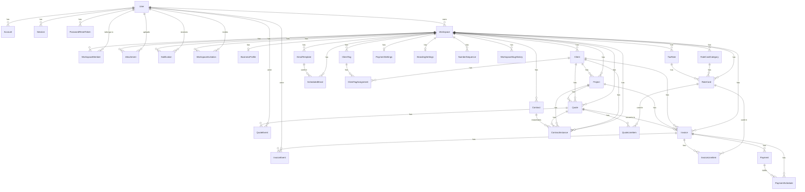

# QuoteCraft Data Model

**Source:** `packages/database/prisma/schema.prisma`
**Database:** PostgreSQL (Neon Serverless)
**ORM:** Prisma 5.x with `fullTextSearch` preview feature
**Binary Targets:** `native`, `rhel-openssl-3.0.x`

---

## Entity-Relationship Diagram



---

## Critical Business Rules

1. **All monetary values are stored in DOLLARS** (not cents). `Decimal(12,2)` fields like `rate`, `amount`, `subtotal`, `total`, `amountPaid` represent dollar amounts directly. `rate: 150` means $150. Never divide by 100 when formatting.
2. **Multi-tenant workspace isolation**: Every data query MUST include `workspaceId` scope. No cross-workspace data leakage.
3. **Soft deletes**: All important entities use `deletedAt` timestamp. Queries must filter `deletedAt: null`.
4. **Runtime overdue computation**: Invoice `overdue` status is computed at runtime from `dueDate < now()`, not stored as a status value.
5. **Dual line-item storage**: Quote line items exist in both the `quote_line_items` table AND the `settings.blocks` JSON field for the visual builder.
6. **Atomic number sequences**: Quote/invoice numbers are generated via transactional upsert on `NumberSequence` to prevent race conditions.
7. **Access token portals**: Quotes, invoices, and contracts use unique UUID `accessToken` fields for public (unauthenticated) client portal access.

---

## Domain 1: Authentication & Users

### User

| Column | Type | Constraints | Description |
|--------|------|-------------|-------------|
| id | UUID | PK, default(uuid()) | Primary identifier |
| email | String | UNIQUE, indexed | Login email address |
| passwordHash | String? | nullable | bcrypt hash (nullable for OAuth-only users) |
| name | String? | nullable | Display name |
| avatarUrl | String? | nullable | Profile image URL |
| emailVerifiedAt | DateTime? | nullable | Email verification timestamp |
| createdAt | DateTime | default(now()) | Creation timestamp |
| updatedAt | DateTime | @updatedAt | Auto-updated timestamp |
| deletedAt | DateTime? | nullable, indexed | Soft delete timestamp |

**DB Table:** `users`
**Indexes:** `[email]`, `[deletedAt]`

### Account

OAuth provider link for NextAuth.

| Column | Type | Constraints | Description |
|--------|------|-------------|-------------|
| id | UUID | PK | Primary identifier |
| userId | UUID | FK -> User, indexed | Owning user |
| type | String | required | Account type (e.g., "oauth") |
| provider | String | UNIQUE(provider, providerAccountId) | OAuth provider name |
| providerAccountId | String | UNIQUE(provider, providerAccountId) | Provider's user ID |
| refreshToken | Text? | nullable | OAuth refresh token |
| accessToken | Text? | nullable | OAuth access token |
| expiresAt | Int? | nullable | Token expiry (unix timestamp) |
| tokenType | String? | nullable | Token type |
| scope | String? | nullable | OAuth scopes |
| idToken | Text? | nullable | OIDC ID token |
| sessionState | String? | nullable | Provider session state |

**DB Table:** `accounts`
**Indexes:** `[userId]`
**Unique:** `[provider, providerAccountId]`
**Cascade:** Delete on User delete

### Session

Active user sessions with IP/user-agent tracking.

| Column | Type | Constraints | Description |
|--------|------|-------------|-------------|
| id | UUID | PK | Primary identifier |
| userId | UUID | FK -> User, indexed | Session owner |
| sessionToken | String | UNIQUE | Session token value |
| expiresAt | DateTime | indexed | Session expiry |
| ipAddress | VarChar(45)? | nullable | Client IP address |
| userAgent | Text? | nullable | Client user agent string |
| createdAt | DateTime | default(now()) | Creation timestamp |

**DB Table:** `sessions`
**Indexes:** `[userId]`, `[expiresAt]`
**Cascade:** Delete on User delete

### PasswordResetToken

Token-based password reset flow with one-hour expiry.

| Column | Type | Constraints | Description |
|--------|------|-------------|-------------|
| id | UUID | PK | Primary identifier |
| userId | UUID | FK -> User, indexed | Token owner |
| token | String | UNIQUE | Reset token value |
| expiresAt | DateTime | required | Token expiry |
| usedAt | DateTime? | nullable | Usage timestamp (prevents reuse) |
| createdAt | DateTime | default(now()) | Creation timestamp |

**DB Table:** `password_reset_tokens`
**Indexes:** `[userId]`
**Cascade:** Delete on User delete

### VerificationToken

Email verification tokens (NextAuth standard).

| Column | Type | Constraints | Description |
|--------|------|-------------|-------------|
| identifier | String | UNIQUE(identifier, token) | Email or identifier |
| token | String | UNIQUE | Verification token |
| expiresAt | DateTime | required | Token expiry |

**DB Table:** `verification_tokens`
**Unique:** `[identifier, token]`

---

## Domain 2: Workspace & Organization

### Workspace

Multi-tenant container. All business data is scoped to a workspace.

| Column | Type | Constraints | Description |
|--------|------|-------------|-------------|
| id | UUID | PK | Primary identifier |
| name | String | required | Workspace display name |
| slug | String | UNIQUE, indexed | URL-safe identifier |
| ownerId | UUID | FK -> User, indexed | Workspace owner |
| settings | Json | default("{}") | Workspace settings (see JSON schema below) |
| createdAt | DateTime | default(now()) | Creation timestamp |
| updatedAt | DateTime | @updatedAt | Auto-updated timestamp |
| deletedAt | DateTime? | nullable | Soft delete timestamp |

**DB Table:** `workspaces`
**Indexes:** `[slug]`, `[ownerId]`

**`settings` JSON Schema:**
```json
{
  "onboardingCompleted": boolean,
  "invoiceDefaults": {
    "paymentTerms": "net30",
    "defaultNotes": "",
    "defaultTerms": "",
    "lateFeeEnabled": false,
    "lateFeeType": "percentage" | "fixed",
    "lateFeeValue": 0,
    "reminderEnabled": true,
    "reminderDays": [7, 3, 1]
  },
  "plan": "free" | "pro" | "team"
}
```

### WorkspaceMember

Team membership with role-based access.

| Column | Type | Constraints | Description |
|--------|------|-------------|-------------|
| id | UUID | PK | Primary identifier |
| workspaceId | UUID | FK -> Workspace, indexed | Parent workspace |
| userId | UUID | FK -> User, indexed | Member user |
| role | String | default("member") | Role: owner, admin, member, viewer |
| invitedAt | DateTime? | nullable | When invited |
| acceptedAt | DateTime? | nullable | When accepted |
| createdAt | DateTime | default(now()) | Creation timestamp |
| updatedAt | DateTime | @updatedAt | Auto-updated timestamp |

**DB Table:** `workspace_members`
**Unique:** `[workspaceId, userId]`
**Indexes:** `[userId]`, `[workspaceId]`
**Cascade:** Delete on Workspace or User delete

### WorkspaceInvitation

Pending workspace invitations.

| Column | Type | Constraints | Description |
|--------|------|-------------|-------------|
| id | UUID | PK | Primary identifier |
| workspaceId | UUID | FK -> Workspace, indexed | Target workspace |
| email | String | indexed | Invitee email |
| role | String | default("member") | Invited role |
| token | String | UNIQUE | Invitation token |
| invitedById | UUID | FK -> User | Inviter user |
| expiresAt | DateTime | required | Invitation expiry |
| acceptedAt | DateTime? | nullable | Acceptance timestamp |
| createdAt | DateTime | default(now()) | Creation timestamp |

**DB Table:** `workspace_invitations`
**Indexes:** `[workspaceId]`, `[email]`
**Cascade:** Delete on Workspace delete

### BusinessProfile

Business information for a workspace (1:1 with Workspace).

| Column | Type | Constraints | Description |
|--------|------|-------------|-------------|
| workspaceId | UUID | PK, FK -> Workspace | Workspace ID (also PK) |
| businessName | String | required | Business display name |
| logoUrl | String? | nullable | Logo image URL |
| email | String? | nullable | Business contact email |
| phone | VarChar(50)? | nullable | Business phone |
| website | String? | nullable | Business website |
| address | Json? | nullable | Business address (see JSON schema) |
| taxId | VarChar(100)? | nullable | Tax identification number |
| currency | VarChar(3) | default("USD") | Default currency code |
| timezone | VarChar(50) | default("UTC") | Default timezone |
| createdAt | DateTime | default(now()) | Creation timestamp |
| updatedAt | DateTime | @updatedAt | Auto-updated timestamp |

**DB Table:** `business_profiles`
**Cascade:** Delete on Workspace delete

**`address` JSON Schema:**
```json
{
  "street": "string?",
  "city": "string?",
  "state": "string?",
  "postalCode": "string?",
  "country": "string?"
}
```

### WorkspaceSlugHistory

Audit trail for workspace slug changes.

| Column | Type | Constraints | Description |
|--------|------|-------------|-------------|
| id | UUID | PK | Primary identifier |
| workspaceId | UUID | FK -> Workspace, indexed | Parent workspace |
| oldSlug | String | indexed | Previous slug value |
| changedAt | DateTime | default(now()) | Change timestamp |

**DB Table:** `workspace_slug_histories`
**Indexes:** `[oldSlug]`, `[workspaceId]`
**Cascade:** Delete on Workspace delete

---

## Domain 3: Clients

### Client

| Column | Type | Constraints | Description |
|--------|------|-------------|-------------|
| id | UUID | PK | Primary identifier |
| workspaceId | UUID | FK -> Workspace, indexed | Parent workspace |
| name | String | required | Client display name |
| company | String? | nullable, indexed | Company name |
| email | String | indexed | Contact email |
| phone | VarChar(50)? | nullable | Contact phone |
| address | Json? | nullable | Primary address (same schema as BusinessProfile) |
| billingAddress | Json? | nullable | Billing address (same schema) |
| taxId | VarChar(100)? | nullable | Client tax ID |
| notes | Text? | nullable | Internal notes |
| metadata | Json | default("{}") | Extended data (see JSON schema) |
| createdAt | DateTime | default(now()) | Creation timestamp |
| updatedAt | DateTime | @updatedAt | Auto-updated timestamp |
| deletedAt | DateTime? | nullable | Soft delete timestamp |

**DB Table:** `clients`
**Indexes:** `[workspaceId]`, `[email]`, `[company]`, `[workspaceId, deletedAt]`
**Cascade:** Delete on Workspace delete

**`metadata` JSON Schema:**
```json
{
  "type": "individual" | "company",
  "website": "string?",
  "tags": ["string"],
  "contacts": [
    {
      "id": "nanoid",
      "name": "string",
      "email": "string?",
      "phone": "string?",
      "role": "string?"
    }
  ]
}
```

### ClientTag

Workspace-scoped tags for client organization.

| Column | Type | Constraints | Description |
|--------|------|-------------|-------------|
| id | UUID | PK | Primary identifier |
| workspaceId | UUID | FK -> Workspace | Parent workspace |
| name | VarChar(50) | UNIQUE(workspaceId, name) | Tag name |
| color | VarChar(7)? | nullable | Hex color code |
| createdAt | DateTime | default(now()) | Creation timestamp |

**DB Table:** `client_tags`
**Unique:** `[workspaceId, name]`
**Cascade:** Delete on Workspace delete

### ClientTagAssignment

Many-to-many join between Client and ClientTag.

| Column | Type | Constraints | Description |
|--------|------|-------------|-------------|
| clientId | UUID | PK (composite), FK -> Client | Client reference |
| tagId | UUID | PK (composite), FK -> ClientTag | Tag reference |

**DB Table:** `client_tag_assignments`
**PK:** `[clientId, tagId]`
**Cascade:** Delete on Client or ClientTag delete

---

## Domain 4: Projects

### Project

Groups quotes and invoices for a client engagement.

| Column | Type | Constraints | Description |
|--------|------|-------------|-------------|
| id | UUID | PK | Primary identifier |
| workspaceId | UUID | FK -> Workspace, indexed | Parent workspace |
| clientId | UUID | FK -> Client, indexed | Parent client |
| name | String | required | Project name |
| description | Text? | nullable | Project description |
| isActive | Boolean | default(true) | Active/archived status |
| createdAt | DateTime | default(now()) | Creation timestamp |
| updatedAt | DateTime | @updatedAt | Auto-updated timestamp |
| deletedAt | DateTime? | nullable | Soft delete timestamp |

**DB Table:** `projects`
**Indexes:** `[workspaceId]`, `[clientId]`, `[workspaceId, isActive]`, `[workspaceId, deletedAt]`
**Cascade:** Delete on Workspace delete

---

## Domain 5: Rate Cards

### RateCardCategory

| Column | Type | Constraints | Description |
|--------|------|-------------|-------------|
| id | UUID | PK | Primary identifier |
| workspaceId | UUID | FK -> Workspace | Parent workspace |
| name | VarChar(100) | UNIQUE(workspaceId, name) | Category name |
| color | VarChar(7)? | nullable | Hex color code |
| sortOrder | Int | default(0) | Display order |
| createdAt | DateTime | default(now()) | Creation timestamp |
| updatedAt | DateTime | @updatedAt | Auto-updated timestamp |
| deletedAt | DateTime? | nullable | Soft delete timestamp |

**DB Table:** `rate_card_categories`
**Unique:** `[workspaceId, name]`
**Cascade:** Delete on Workspace delete

### RateCard

Pricing template used in quote/invoice line items.

| Column | Type | Constraints | Description |
|--------|------|-------------|-------------|
| id | UUID | PK | Primary identifier |
| workspaceId | UUID | FK -> Workspace, indexed | Parent workspace |
| categoryId | UUID? | FK -> RateCardCategory, indexed | Category grouping |
| name | String | required | Rate card name |
| description | Text? | nullable | Description |
| pricingType | VarChar(20) | default("fixed") | "fixed" or "hourly" |
| rate | Decimal(12,2) | required | Price in dollars |
| unit | VarChar(50)? | nullable | Unit label (e.g., "hour", "project") |
| taxRateId | UUID? | FK -> TaxRate | Default tax rate |
| isActive | Boolean | default(true) | Active status |
| createdAt | DateTime | default(now()) | Creation timestamp |
| updatedAt | DateTime | @updatedAt | Auto-updated timestamp |
| deletedAt | DateTime? | nullable | Soft delete timestamp |

**DB Table:** `rate_cards`
**Indexes:** `[workspaceId]`, `[categoryId]`, `[workspaceId, isActive]`
**Cascade:** Delete on Workspace delete

---

## Domain 6: Quotes

### Quote

| Column | Type | Constraints | Description |
|--------|------|-------------|-------------|
| id | UUID | PK | Primary identifier |
| workspaceId | UUID | FK -> Workspace, indexed | Parent workspace |
| clientId | UUID | FK -> Client, indexed | Client |
| projectId | UUID? | FK -> Project, indexed | Optional project |
| quoteNumber | VarChar(50) | UNIQUE(workspaceId, quoteNumber) | Auto-generated number (e.g., "QT-0001") |
| status | VarChar(20) | default("draft"), indexed | See status state machine below |
| title | String? | nullable | Quote title |
| issueDate | Date | default(now()) | Issue date |
| expirationDate | Date? | nullable, indexed | Expiration date |
| subtotal | Decimal(12,2) | default(0) | Sum of line item amounts (dollars) |
| discountType | VarChar(10)? | nullable | "percentage" or "fixed" |
| discountValue | Decimal(12,2)? | nullable | Discount value |
| discountAmount | Decimal(12,2) | default(0) | Computed discount amount (dollars) |
| taxTotal | Decimal(12,2) | default(0) | Sum of line item tax (dollars) |
| total | Decimal(12,2) | default(0) | Grand total (dollars) |
| notes | Text? | nullable | Client-visible notes |
| terms | Text? | nullable | Terms and conditions |
| internalNotes | Text? | nullable | Internal notes (not client-visible) |
| settings | Json | default("{}") | Visual builder data (see JSON schema) |
| accessToken | VarChar(100) | UNIQUE, default(uuid()), indexed | Public portal token |
| viewedAt | DateTime? | nullable | First client view timestamp |
| viewCount | Int | default(0) | Client view count |
| sentAt | DateTime? | nullable | When sent to client |
| acceptedAt | DateTime? | nullable | Client acceptance timestamp |
| declinedAt | DateTime? | nullable | Client decline timestamp |
| signedAt | DateTime? | nullable | E-signature timestamp |
| signatureData | Json? | nullable | Signature data |
| convertedToInvoiceId | UUID? | nullable | Linked invoice ID after conversion |
| pdfUrl | String? | nullable | Generated PDF URL |
| createdAt | DateTime | default(now()), indexed(desc) | Creation timestamp |
| updatedAt | DateTime | @updatedAt | Auto-updated timestamp |
| deletedAt | DateTime? | nullable | Soft delete timestamp |

**DB Table:** `quotes`
**Indexes:** `[workspaceId]`, `[clientId]`, `[projectId]`, `[status]`, `[accessToken]`, `[workspaceId, status]`, `[expirationDate]`, `[createdAt DESC]`
**Unique:** `[workspaceId, quoteNumber]`

**Quote Status State Machine:**
```
draft -> sent -> viewed -> accepted -> (converted internally)
                        -> declined -> draft (re-draft)
                        -> expired  -> draft (re-draft)
```

**`settings` JSON Schema:**
```json
{
  "blocks": [QuoteBlock],
  "requireSignature": true,
  "autoConvertToInvoice": false,
  "depositRequired": false,
  "depositType": "percentage" | "fixed",
  "depositValue": 50,
  "showLineItemPrices": true,
  "allowPartialAcceptance": false,
  "currency": "USD",
  "taxInclusive": false
}
```

**`signatureData` JSON Schema:**
```json
{
  "signerName": "string",
  "signedAt": "ISO8601 string",
  "data": "base64 image data"
}
```

### QuoteLineItem

| Column | Type | Constraints | Description |
|--------|------|-------------|-------------|
| id | UUID | PK | Primary identifier |
| quoteId | UUID | FK -> Quote, indexed | Parent quote |
| rateCardId | UUID? | FK -> RateCard | Source rate card |
| name | String | required | Line item name |
| description | Text? | nullable | Line item description |
| quantity | Decimal(10,2) | default(1) | Quantity |
| rate | Decimal(12,2) | required | Unit price (dollars) |
| amount | Decimal(12,2) | required | qty * rate (dollars) |
| taxRate | Decimal(5,2)? | nullable | Tax percentage |
| taxAmount | Decimal(12,2) | default(0) | Computed tax (dollars) |
| sortOrder | Int | default(0) | Display order |
| createdAt | DateTime | default(now()) | Creation timestamp |
| updatedAt | DateTime | @updatedAt | Auto-updated timestamp |

**DB Table:** `quote_line_items`
**Indexes:** `[quoteId]`, `[quoteId, sortOrder]`
**Cascade:** Delete on Quote delete

### QuoteEvent

Audit trail for quote lifecycle events.

| Column | Type | Constraints | Description |
|--------|------|-------------|-------------|
| id | UUID | PK | Primary identifier |
| quoteId | UUID | FK -> Quote, indexed | Parent quote |
| eventType | VarChar(50) | required | Event type (created, sent, viewed, accepted, etc.) |
| actorId | UUID? | FK -> User | Acting user (null for system) |
| actorType | VarChar(20) | default("user") | "user" or "system" or "client" |
| metadata | Json | default("{}") | Event-specific data |
| ipAddress | VarChar(45)? | nullable | Actor IP address |
| userAgent | Text? | nullable | Actor user agent |
| createdAt | DateTime | default(now()), indexed(desc) | Event timestamp |

**DB Table:** `quote_events`
**Indexes:** `[quoteId]`, `[createdAt DESC]`
**Cascade:** Delete on Quote delete

---

## Domain 7: Invoices

### Invoice

| Column | Type | Constraints | Description |
|--------|------|-------------|-------------|
| id | UUID | PK | Primary identifier |
| workspaceId | UUID | FK -> Workspace, indexed | Parent workspace |
| clientId | UUID | FK -> Client, indexed | Client |
| projectId | UUID? | FK -> Project, indexed | Optional project |
| quoteId | UUID? | UNIQUE, FK -> Quote, indexed | Source quote (1:1) |
| invoiceNumber | VarChar(50) | UNIQUE(workspaceId, invoiceNumber) | Auto-generated (e.g., "INV-0001") |
| status | VarChar(20) | default("draft"), indexed | See status info below |
| title | String? | nullable | Invoice title |
| issueDate | Date | default(now()) | Issue date |
| dueDate | Date | required, indexed | Payment due date |
| subtotal | Decimal(12,2) | default(0) | Subtotal (dollars) |
| discountType | VarChar(10)? | nullable | "percentage" or "fixed" |
| discountValue | Decimal(12,2)? | nullable | Discount value |
| discountAmount | Decimal(12,2) | default(0) | Computed discount (dollars) |
| taxTotal | Decimal(12,2) | default(0) | Tax total (dollars) |
| total | Decimal(12,2) | default(0) | Grand total (dollars) |
| amountPaid | Decimal(12,2) | default(0) | Total paid (dollars) |
| amountDue | Decimal(12,2) | default(0) | Remaining due (dollars) |
| notes | Text? | nullable | Client-visible notes |
| terms | Text? | nullable | Terms and conditions |
| internalNotes | Text? | nullable | Internal notes |
| settings | Json | default("{}") | Invoice settings |
| accessToken | VarChar(100) | UNIQUE, default(uuid()), indexed | Public portal token |
| viewedAt | DateTime? | nullable | First client view |
| viewCount | Int | default(0) | Client view count |
| sentAt | DateTime? | nullable | When sent |
| paidAt | DateTime? | nullable | Full payment timestamp |
| voidedAt | DateTime? | nullable | Void timestamp |
| pdfUrl | String? | nullable | Generated PDF URL |
| createdAt | DateTime | default(now()), indexed(desc) | Creation timestamp |
| updatedAt | DateTime | @updatedAt | Auto-updated timestamp |
| deletedAt | DateTime? | nullable | Soft delete timestamp |

**DB Table:** `invoices`
**Indexes:** `[workspaceId]`, `[clientId]`, `[projectId]`, `[quoteId]`, `[status]`, `[accessToken]`, `[workspaceId, status]`, `[dueDate]`, `[createdAt DESC]`
**Unique:** `[workspaceId, invoiceNumber]`, `[quoteId]` (one invoice per quote)

**Invoice Status Values:**
- `draft` - Not yet sent
- `sent` - Sent to client
- `viewed` - Client has viewed
- `partial` - Partially paid
- `paid` - Fully paid
- `voided` - Voided/cancelled
- `overdue` - **Computed at runtime** when `dueDate < now()` and status is sent/viewed/partial

**`settings` JSON Schema:**
```json
{
  "currency": "USD",
  "showLineItemPrices": true,
  "paymentTerms": "net30",
  "lateFeeEnabled": false,
  "lateFeeType": "percentage" | "fixed",
  "lateFeeValue": 0,
  "reminderEnabled": true,
  "reminderDays": [7, 3, 1]
}
```

### InvoiceLineItem

Same structure as QuoteLineItem but linked to Invoice.

| Column | Type | Constraints | Description |
|--------|------|-------------|-------------|
| id | UUID | PK | Primary identifier |
| invoiceId | UUID | FK -> Invoice, indexed | Parent invoice |
| rateCardId | UUID? | FK -> RateCard | Source rate card |
| name | String | required | Line item name |
| description | Text? | nullable | Description |
| quantity | Decimal(10,2) | default(1) | Quantity |
| rate | Decimal(12,2) | required | Unit price (dollars) |
| amount | Decimal(12,2) | required | qty * rate (dollars) |
| taxRate | Decimal(5,2)? | nullable | Tax percentage |
| taxAmount | Decimal(12,2) | default(0) | Computed tax (dollars) |
| sortOrder | Int | default(0) | Display order |
| createdAt | DateTime | default(now()) | Creation timestamp |
| updatedAt | DateTime | @updatedAt | Auto-updated timestamp |

**DB Table:** `invoice_line_items`
**Indexes:** `[invoiceId]`, `[invoiceId, sortOrder]`
**Cascade:** Delete on Invoice delete

### InvoiceEvent

Audit trail for invoice lifecycle events.

| Column | Type | Constraints | Description |
|--------|------|-------------|-------------|
| id | UUID | PK | Primary identifier |
| invoiceId | UUID | FK -> Invoice, indexed | Parent invoice |
| eventType | VarChar(50) | required | Event type |
| actorId | UUID? | FK -> User | Acting user |
| actorType | VarChar(20) | default("user") | "user" or "system" |
| metadata | Json | default("{}") | Event-specific data |
| ipAddress | VarChar(45)? | nullable | Actor IP |
| userAgent | Text? | nullable | Actor user agent |
| createdAt | DateTime | default(now()), indexed(desc) | Event timestamp |

**DB Table:** `invoice_events`
**Indexes:** `[invoiceId]`, `[createdAt DESC]`
**Cascade:** Delete on Invoice delete

---

## Domain 8: Payments

### Payment

| Column | Type | Constraints | Description |
|--------|------|-------------|-------------|
| id | UUID | PK | Primary identifier |
| invoiceId | UUID | FK -> Invoice, indexed | Parent invoice |
| amount | Decimal(12,2) | required | Payment amount (dollars) |
| currency | VarChar(3) | default("USD") | Currency code |
| paymentMethod | VarChar(20) | required | "card", "bank_transfer", "check", etc. |
| status | VarChar(20) | default("pending"), indexed | "pending", "completed", "failed", "refunded" |
| stripePaymentIntentId | String? | nullable, indexed | Stripe PI ID |
| stripeChargeId | String? | nullable | Stripe charge ID |
| stripeReceiptUrl | String? | nullable | Stripe receipt URL |
| referenceNumber | VarChar(100)? | nullable | Manual payment reference |
| notes | Text? | nullable | Payment notes |
| processedAt | DateTime? | nullable | Processing timestamp |
| refundedAt | DateTime? | nullable | Refund timestamp |
| refundAmount | Decimal(12,2)? | nullable | Refund amount |
| refundReason | Text? | nullable | Refund reason |
| createdAt | DateTime | default(now()), indexed(desc) | Creation timestamp |
| updatedAt | DateTime | @updatedAt | Auto-updated timestamp |

**DB Table:** `payments`
**Indexes:** `[invoiceId]`, `[status]`, `[stripePaymentIntentId]`, `[createdAt DESC]`

### PaymentSchedule

Milestone payment schedules for invoices.

| Column | Type | Constraints | Description |
|--------|------|-------------|-------------|
| id | UUID | PK | Primary identifier |
| invoiceId | UUID | FK -> Invoice, indexed | Parent invoice |
| type | VarChar(20) | required | Schedule type (e.g., "milestone", "deposit") |
| description | String? | nullable | Milestone description |
| amount | Decimal(12,2)? | nullable | Fixed amount |
| percentage | Decimal(5,2)? | nullable | Percentage of total |
| dueDate | Date | required | Milestone due date |
| status | VarChar(20) | default("pending") | "pending", "paid" |
| paymentId | UUID? | FK -> Payment | Fulfilling payment |
| createdAt | DateTime | default(now()) | Creation timestamp |
| updatedAt | DateTime | @updatedAt | Auto-updated timestamp |

**DB Table:** `payment_schedules`
**Indexes:** `[invoiceId]`, `[dueDate, status]`
**Cascade:** Delete on Invoice delete

---

## Domain 9: Contracts

### Contract

Reusable contract templates with variable placeholders.

| Column | Type | Constraints | Description |
|--------|------|-------------|-------------|
| id | UUID | PK | Primary identifier |
| workspaceId | UUID | FK -> Workspace, indexed | Parent workspace |
| name | String | required | Template name |
| content | Text | required | Rich text content with `{{variable}}` placeholders |
| isTemplate | Boolean | default(false) | Whether this is a reusable template |
| variables | Json | default("[]") | Variable definitions |
| createdAt | DateTime | default(now()) | Creation timestamp |
| updatedAt | DateTime | @updatedAt | Auto-updated timestamp |
| deletedAt | DateTime? | nullable | Soft delete timestamp |

**DB Table:** `contracts`
**Indexes:** `[workspaceId]`, `[workspaceId, isTemplate]`
**Cascade:** Delete on Workspace delete

**`variables` JSON Schema:**
```json
[
  {
    "key": "string",
    "label": "string",
    "type": "text" | "date" | "number",
    "defaultValue": "string?",
    "required": boolean
  }
]
```

### ContractInstance

Signed copy of a contract, sent to a specific client.

| Column | Type | Constraints | Description |
|--------|------|-------------|-------------|
| id | UUID | PK | Primary identifier |
| contractId | UUID | FK -> Contract, indexed | Source template |
| quoteId | UUID? | FK -> Quote, indexed | Associated quote |
| clientId | UUID | FK -> Client, indexed | Recipient client |
| projectId | UUID? | FK -> Project, indexed | Associated project |
| workspaceId | UUID | FK -> Workspace | Parent workspace |
| content | Text | required | Rendered contract content |
| status | VarChar(20) | default("draft") | "draft", "sent", "viewed", "signed" |
| accessToken | VarChar(100) | UNIQUE, default(uuid()), indexed | Public portal token |
| sentAt | DateTime? | nullable | When sent |
| viewedAt | DateTime? | nullable | First client view |
| signedAt | DateTime? | nullable | Signature timestamp |
| signatureData | Json? | nullable | E-signature data |
| signerIpAddress | VarChar(45)? | nullable | Signer IP (audit trail) |
| signerUserAgent | Text? | nullable | Signer user agent (audit trail) |
| pdfUrl | String? | nullable | Generated PDF URL |
| createdAt | DateTime | default(now()) | Creation timestamp |
| updatedAt | DateTime | @updatedAt | Auto-updated timestamp |
| deletedAt | DateTime? | nullable | Soft delete timestamp |

**DB Table:** `contract_instances`
**Indexes:** `[contractId]`, `[quoteId]`, `[clientId]`, `[projectId]`, `[accessToken]`
**Cascade:** Delete on Workspace delete

---

## Domain 10: Configuration

### TaxRate

| Column | Type | Constraints | Description |
|--------|------|-------------|-------------|
| id | UUID | PK | Primary identifier |
| workspaceId | UUID | FK -> Workspace, indexed | Parent workspace |
| name | VarChar(100) | required | Tax rate name (e.g., "Sales Tax") |
| rate | Decimal(5,2) | required | Tax percentage |
| description | String? | nullable | Description |
| isInclusive | Boolean | default(false) | Tax-inclusive pricing |
| isDefault | Boolean | default(false) | Default tax rate for new items |
| isActive | Boolean | default(true) | Active status |
| createdAt | DateTime | default(now()) | Creation timestamp |
| updatedAt | DateTime | @updatedAt | Auto-updated timestamp |
| deletedAt | DateTime? | nullable | Soft delete timestamp |

**DB Table:** `tax_rates`
**Indexes:** `[workspaceId]`
**Cascade:** Delete on Workspace delete

### PaymentSettings

Stripe Connect configuration (1:1 with Workspace).

| Column | Type | Constraints | Description |
|--------|------|-------------|-------------|
| workspaceId | UUID | PK, FK -> Workspace | Workspace ID (also PK) |
| stripeAccountId | String? | nullable | Stripe Connect account ID |
| stripeAccountStatus | VarChar(20)? | nullable | "active", "pending", "error" |
| stripeOnboardingComplete | Boolean | default(false) | Onboarding completion flag |
| enabledPaymentMethods | Json | default('["card"]') | Enabled payment methods array |
| passProcessingFees | Boolean | default(false) | Pass Stripe fees to client |
| defaultPaymentTerms | Int | default(30) | Default payment terms (days) |
| createdAt | DateTime | default(now()) | Creation timestamp |
| updatedAt | DateTime | @updatedAt | Auto-updated timestamp |

**DB Table:** `payment_settings`
**Cascade:** Delete on Workspace delete

### BrandingSettings

Visual customization (1:1 with Workspace).

| Column | Type | Constraints | Description |
|--------|------|-------------|-------------|
| workspaceId | UUID | PK, FK -> Workspace | Workspace ID (also PK) |
| primaryColor | VarChar(7)? | nullable | Primary hex color |
| secondaryColor | VarChar(7)? | nullable | Secondary hex color |
| accentColor | VarChar(7)? | nullable | Accent hex color |
| logoUrl | String? | nullable | Logo URL |
| faviconUrl | String? | nullable | Favicon URL |
| customCss | Text? | nullable | Custom CSS override |
| fontFamily | VarChar(100)? | nullable | Custom font family |
| createdAt | DateTime | default(now()) | Creation timestamp |
| updatedAt | DateTime | @updatedAt | Auto-updated timestamp |

**DB Table:** `branding_settings`
**Cascade:** Delete on Workspace delete

### NumberSequence

Atomic auto-numbering for quotes and invoices.

| Column | Type | Constraints | Description |
|--------|------|-------------|-------------|
| id | UUID | PK | Primary identifier |
| workspaceId | UUID | FK -> Workspace | Parent workspace |
| type | VarChar(20) | UNIQUE(workspaceId, type) | "quote" or "invoice" |
| prefix | VarChar(20)? | nullable | Number prefix (e.g., "QT", "INV") |
| suffix | VarChar(20)? | nullable | Number suffix |
| currentValue | Int | default(0) | Current sequence value |
| padding | Int | default(4) | Zero-padding width |
| createdAt | DateTime | default(now()) | Creation timestamp |
| updatedAt | DateTime | @updatedAt | Auto-updated timestamp |

**DB Table:** `number_sequences`
**Unique:** `[workspaceId, type]`
**Cascade:** Delete on Workspace delete

**Number Format:** `{prefix}-{currentValue padded to {padding} digits}[-{suffix}]`
Example: prefix="QT", currentValue=42, padding=4 produces "QT-0042"

---

## Domain 11: Supporting

### EmailTemplate

| Column | Type | Constraints | Description |
|--------|------|-------------|-------------|
| id | UUID | PK | Primary identifier |
| workspaceId | UUID | FK -> Workspace | Parent workspace |
| type | VarChar(50) | required | Template type (quote_sent, invoice_sent, etc.) |
| name | VarChar(100) | required | Template name |
| subject | String | required | Email subject (supports `{{variables}}`) |
| body | Text | required | Email body HTML (supports `{{variables}}` and `{{#if}}`) |
| isActive | Boolean | default(true) | Active status |
| isDefault | Boolean | default(false) | Default template for type |
| createdAt | DateTime | default(now()) | Creation timestamp |
| updatedAt | DateTime | @updatedAt | Auto-updated timestamp |
| deletedAt | DateTime? | nullable | Soft delete timestamp |

**DB Table:** `email_templates`
**Indexes:** `[workspaceId, type]`
**Cascade:** Delete on Workspace delete

### ScheduledEmail

Email queue for deferred sending.

| Column | Type | Constraints | Description |
|--------|------|-------------|-------------|
| id | UUID | PK | Primary identifier |
| workspaceId | UUID | FK -> Workspace | Parent workspace |
| templateId | UUID? | FK -> EmailTemplate | Source template |
| type | VarChar(50) | required | Email type |
| entityType | VarChar(20) | required | Related entity type (quote, invoice, contract) |
| entityId | UUID | required | Related entity ID |
| recipientEmail | String | required | Recipient email address |
| recipientName | String? | nullable | Recipient display name |
| subject | String | required | Rendered subject |
| body | Text | required | Rendered body HTML |
| scheduledFor | DateTime | required | Scheduled send time |
| status | VarChar(20) | default("pending") | "pending", "sent", "failed", "cancelled" |
| sentAt | DateTime? | nullable | Actual send time |
| errorMessage | Text? | nullable | Error message if failed |
| retryCount | Int | default(0) | Number of retry attempts |
| createdAt | DateTime | default(now()) | Creation timestamp |
| updatedAt | DateTime | @updatedAt | Auto-updated timestamp |

**DB Table:** `scheduled_emails`
**Indexes:** `[scheduledFor, status]`, `[entityType, entityId]`
**Cascade:** Delete on Workspace delete

### Attachment

| Column | Type | Constraints | Description |
|--------|------|-------------|-------------|
| id | UUID | PK | Primary identifier |
| workspaceId | UUID | FK -> Workspace, indexed | Parent workspace |
| entityType | VarChar(20) | required | Attached to entity type |
| entityId | UUID | required | Attached to entity ID |
| filename | String | required | Original filename |
| filePath | String | required | Storage path |
| fileSize | Int | required | File size in bytes |
| mimeType | VarChar(100) | required | MIME type |
| uploadedById | UUID | FK -> User | Uploader user |
| isPublic | Boolean | default(false) | Public access flag |
| uploadedAt | DateTime | default(now()) | Upload timestamp |
| deletedAt | DateTime? | nullable | Soft delete timestamp |

**DB Table:** `attachments`
**Indexes:** `[entityType, entityId]`, `[workspaceId]`
**Cascade:** Delete on Workspace delete

### Notification

In-app notification system.

| Column | Type | Constraints | Description |
|--------|------|-------------|-------------|
| id | UUID | PK | Primary identifier |
| userId | UUID | FK -> User | Recipient user |
| workspaceId | UUID | FK -> Workspace, indexed | Parent workspace |
| type | VarChar(50) | required | Notification type (quote_viewed, invoice_paid, etc.) |
| title | String | required | Notification title |
| message | String? | nullable | Notification body |
| entityType | VarChar(20)? | nullable | Related entity type |
| entityId | UUID? | nullable | Related entity ID |
| link | String? | nullable | Navigation URL |
| isRead | Boolean | default(false) | Read status |
| readAt | DateTime? | nullable | Read timestamp |
| createdAt | DateTime | default(now()), indexed | Creation timestamp |

**DB Table:** `notifications`
**Indexes:** `[userId, isRead]`, `[workspaceId]`, `[createdAt]`
**Cascade:** Delete on User or Workspace delete

---

## Index Summary

| Table | Index | Columns | Purpose |
|-------|-------|---------|---------|
| users | unique | email | Login lookup |
| users | index | deletedAt | Soft delete filter |
| accounts | unique | provider, providerAccountId | OAuth uniqueness |
| sessions | unique | sessionToken | Session lookup |
| sessions | index | expiresAt | Cleanup query |
| workspaces | unique | slug | URL routing |
| workspace_members | unique | workspaceId, userId | Membership uniqueness |
| clients | index | workspaceId, deletedAt | Workspace-scoped listing |
| quotes | unique | workspaceId, quoteNumber | Number uniqueness |
| quotes | index | workspaceId, status | Dashboard filtering |
| quotes | index | createdAt DESC | Recent listing |
| quotes | unique | accessToken | Portal lookup |
| invoices | unique | workspaceId, invoiceNumber | Number uniqueness |
| invoices | unique | quoteId | One invoice per quote |
| invoices | index | dueDate | Overdue computation |
| invoices | unique | accessToken | Portal lookup |
| payments | index | stripePaymentIntentId | Webhook lookup |
| contract_instances | unique | accessToken | Portal lookup |
| number_sequences | unique | workspaceId, type | Atomic increment |
| email_templates | index | workspaceId, type | Template lookup by type |
| scheduled_emails | index | scheduledFor, status | Queue processing |
